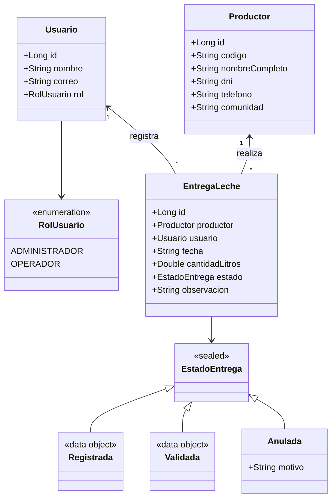

# Modelo de Dominio - EcoLact

## 1. Objetivo
El objetivo del modelo de dominio de **EcoLact** es representar y encapsular la lógica de negocio central correspondiente al proceso de acopio diario de leche. El modelo asegura que todas las operaciones de recepción cumplan con las reglas de negocio (validaciones de cantidad, identidad del productor y trazabilidad del operador) antes de ser persistidas o presentadas en la interfaz de usuario en Compose Multiplatform.

---

## 2. Entidad principal

### `EntregaLeche`
Es el núcleo transaccional del sistema. Representa el evento físico y administrativo en el cual un productor entrega una cantidad específica de leche en el centro de acopio.

- **Atributos:**
  - `id: Long` — Identificador único de la entrega.
  - `productor: Productor` — Productor que realiza la entrega.
  - `usuario: Usuario` — Operador o administrador que registra el acopio.
  - `fecha: String` — Fecha y hora del registro (formato ISO-8601 / `YYYY-MM-DD`).
  - `cantidadLitros: Double` — Volumen entregado medido en litros (debe ser mayor a cero).
  - `estado: EstadoEntrega` — Estado de flujo de la entrega (`Registrada`, `Validada`, `Anulada`).
  - `observacion: String?` — Comentario opcional (ej. calidad organoléptica, temperatura).

---

## 3. Entidades secundarias

### `Productor`
Representa al socio ganadero o proveedor de leche.
- **Atributos:**
  - `id: Long` — Identificador único.
  - `codigo: String` — Código de socio o productor (ej. `PROD-001`).
  - `nombreCompleto: String` — Nombres y apellidos.
  - `dni: String` — Documento Nacional de Identidad (exactamente 8 dígitos numéricos).
  - `telefono: String` — Número de contacto.
  - `comunidad: String` — Sector, ruta o comunidad de procedencia.

### `Usuario`
Representa al personal que opera la aplicación en el punto de acopio.
- **Atributos:**
  - `id: Long` — Identificador único del usuario.
  - `nombre: String` — Nombre del operador.
  - `correo: String` — Correo electrónico institucional o de acceso.
  - `rol: RolUsuario` — Rol de acceso asignado en el sistema.

---

## 4. Enumeraciones

### `RolUsuario`
Define los roles con privilegios cerrados dentro del sistema:
- `ADMINISTRADOR`: Acceso a reportes globales, anulación de entregas y configuración de precios/productores.
- `OPERADOR`: Encargado del registro rápido de entregas en campo/planta.

```kotlin
enum class RolUsuario {
    ADMINISTRADOR,
    OPERADOR
}
```

---

## 5. Estados con `sealed class`

### `EstadoEntrega`
Representa el ciclo de vida y control de calidad de un registro de acopio. Se implementa con `sealed class` para garantizar exhaustividad en las expresiones `when` en la capa de UI.

- `Registrada`: Estado inicial por defecto cuando el operador pesa/mide la leche.
- `Validada`: Estado confirmado tras verificación de calidad o cierre de turno.
- `Anulada`: Estado asignado cuando una entrega fue cancelada o rechazada (incluye motivo).

```kotlin
sealed class EstadoEntrega {
    data object Registrada : EstadoEntrega()
    data object Validada : EstadoEntrega()
    data class Anulada(val motivo: String) : EstadoEntrega()
}
```

---

## 6. Relaciones entre entidades

```
┌─────────────────────────┐
│       Productor         │
├─────────────────────────┤
│ id: Long                │
│ codigo: String          │
│ nombreCompleto: String  │
│ dni: String             │
│ telefono: String        │
│ comunidad: String       │
└───────────┬─────────────┘
            │ 1
            │
            │ *
┌───────────▼─────────────┐             ┌─────────────────────────┐
│      EntregaLeche       │ 1         * │         Usuario         │
├─────────────────────────┼─────────────┤─────────────────────────┤
│ id: Long                │             │ id: Long                │
│ fecha: String           │             │ nombre: String          │
│ cantidadLitros: Double  │             │ correo: String          │
│ observacion: String?    │             │ rol: RolUsuario (Enum)  │
│ estado: EstadoEntrega   │             └─────────────────────────┘
│ (Sealed: Registrada,    │
│  Validada, Anulada)     │
└─────────────────────────┘
```

- **Productor (1) ─── (*) EntregaLeche:** Un productor puede registrar múltiples entregas de leche a lo largo del tiempo.
- **Usuario (1) ─── (*) EntregaLeche:** Un usuario (operador) registra múltiples entregas en su jornada.

---

## 7. Reglas del dominio

1. **R1 — Volumen estrictamente positivo:** La cantidad de litros registrada en `EntregaLeche` debe ser mayor a 0 (`cantidadLitros > 0.0`).
2. **R2 — Validación de DNI:** El documento de identidad del `Productor` debe contener exactamente 8 dígitos numéricos.
3. **R3 — Estado inicial determinista:** Toda nueva entrega creada sin especificar estado explícito debe iniciar en `EstadoEntrega.Registrada`.
4. **R4 — Integridad de asociación:** Toda entrega debe estar ligada de manera no nula a un `Productor` y a un `Usuario` responsable.

---

## 8. Decisiones de diseño

1. **`EntregaLeche` como Root Entity:** El propósito operativo de EcoLact es registrar el acopio. Por ello, la entrega es la entidad principal que orquesta el modelo y será la fuente de datos para las pantallas de registro y listado.
2. **Uso de `sealed class` vs `enum` para estados:** Permite que estados como `Anulada` contengan información adicional (como el `motivo`) manteniendo tipado estricto y chequeo exhaustivo en tiempo de compilación.
3. **Invariantes en el constructor (`init`):** Las reglas críticas de validación se validan en el bloque `init` mediante `require(...)`, garantizando que ninguna entidad inconsistente pueda existir en memoria.

---

## 9. Diagrama del modelo (Mermaid)



---

## 10. Correspondencia con el código

| Elemento de Diseño | Archivo en `commonMain` | Responsabilidad |
| :--- | :--- | :--- |
| **Entidad Principal** | `domain/EntregaLeche.kt` | Control de la transacción de entrega y regla `cantidadLitros > 0`. |
| **Entidad Secundaria** | `domain/Productor.kt` | Datos del ganadero y validación de formato DNI (8 dígitos). |
| **Entidad Secundaria** | `domain/Usuario.kt` | Datos del operador/administrador del sistema. |
| **Enum** | `domain/RolUsuario.kt` | Tipificación de privilegios de usuario. |
| **Sealed Class** | `domain/EstadoEntrega.kt` | Modelado de estados (`Registrada`, `Validada`, `Anulada`). |
| **Suite de Pruebas** | `commonTest/.../EntregaLecheTest.kt` | Verificación automatizada de las 4 reglas de dominio. |

---

## 11. Implementación del Modelo en Kotlin (`commonMain`)

Estructura de paquetes: `composeApp/src/commonMain/kotlin/com/ecolact/domain/`

### 11.1. `RolUsuario.kt` (Enumeración)
```kotlin
package com.ecolact.domain

enum class RolUsuario {
    ADMINISTRADOR,
    OPERADOR
}
```

### 11.2. `EstadoEntrega.kt` (Sealed Class)
```kotlin
package com.ecolact.domain

sealed class EstadoEntrega {
    data object Registrada : EstadoEntrega()
    data object Validada : EstadoEntrega()
    data class Anulada(val motivo: String) : EstadoEntrega()
}
```

### 11.3. `Productor.kt` (Entidad Secundaria)
```kotlin
package com.ecolact.domain

data class Productor(
    val id: Long,
    val codigo: String,
    val nombreCompleto: String,
    val dni: String,
    val telefono: String,
    val comunidad: String
) {
    init {
        require(dni.length == 8 && dni.all { it.isDigit() }) {
            "El DNI debe contener exactamente 8 dígitos numéricos"
        }
        require(nombreCompleto.isNotBlank()) {
            "El nombre completo no puede estar vacío"
        }
    }
}
```

### 11.4. `Usuario.kt` (Entidad Secundaria)
```kotlin
package com.ecolact.domain

data class Usuario(
    val id: Long,
    val nombre: String,
    val correo: String,
    val rol: RolUsuario
)
```

### 11.5. `EntregaLeche.kt` (Entidad Principal / Root Entity)
```kotlin
package com.ecolact.domain

data class EntregaLeche(
    val id: Long,
    val productor: Productor,
    val usuario: Usuario,
    val fecha: String,
    val cantidadLitros: Double,
    val estado: EstadoEntrega = EstadoEntrega.Registrada,
    val observacion: String? = null
) {
    init {
        require(cantidadLitros > 0.0) {
            "La cantidad de leche debe ser mayor a cero"
        }
    }
}
```

---

## 12. Pruebas Unitarias de Dominio (`commonTest`)

Ubicación del archivo: `composeApp/src/commonTest/kotlin/com/ecolact/domain/EntregaLecheTest.kt`

```kotlin
package com.ecolact.domain

import kotlin.test.Test
import kotlin.test.assertEquals
import kotlin.test.assertFailsWith
import kotlin.test.assertIs

class EntregaLecheTest {

    private val productorValido = Productor(
        id = 1L,
        codigo = "PROD-001",
        nombreCompleto = "Juan Quispe",
        dni = "70123456",
        telefono = "951234567",
        comunidad = "Sector Centro"
    )

    private val usuarioOperador = Usuario(
        id = 10L,
        nombre = "Carlos Operador",
        correo = "carlos@ecolact.pe",
        rol = RolUsuario.OPERADOR
    )

    // Regla 1: Validar que una cantidad mayor a cero sea válida
    @Test
    fun testCantidadMayorACeroEsValida() {
        val entrega = EntregaLeche(
            id = 100L,
            productor = productorValido,
            usuario = usuarioOperador,
            fecha = "2026-08-24",
            cantidadLitros = 45.5
        )
        assertEquals(45.5, entrega.cantidadLitros)
    }

    // Regla 1 (negativa): Validar que cantidades <= 0 lancen IllegalArgumentException
    @Test
    fun testCantidadMenorOIgualACeroEsRechazada() {
        assertFailsWith<IllegalArgumentException> {
            EntregaLeche(
                id = 101L,
                productor = productorValido,
                usuario = usuarioOperador,
                fecha = "2026-08-24",
                cantidadLitros = 0.0
            )
        }

        assertFailsWith<IllegalArgumentException> {
            EntregaLeche(
                id = 102L,
                productor = productorValido,
                usuario = usuarioOperador,
                fecha = "2026-08-24",
                cantidadLitros = -10.0
            )
        }
    }

    // Regla 2: Validar formato del DNI del productor (8 dígitos numéricos)
    @Test
    fun testValidacionDniProductor() {
        assertFailsWith<IllegalArgumentException> {
            Productor(
                id = 2L,
                codigo = "PROD-002",
                nombreCompleto = "Ana Mamani",
                dni = "1234", // DNI inválido
                telefono = "987654321",
                comunidad = "Sector Norte"
            )
        }
    }

    // Regla 3: Validar que el estado inicial por defecto sea Registrada
    @Test
    fun testNuevaEntregaIniciaEnEstadoRegistrada() {
        val entrega = EntregaLeche(
            id = 103L,
            productor = productorValido,
            usuario = usuarioOperador,
            fecha = "2026-08-24",
            cantidadLitros = 20.0
        )
        assertIs<EstadoEntrega.Registrada>(entrega.estado)
    }
}
```

---

## 13. Guía de Ejecución y Evidencias

### Comandos de Ejecución de Pruebas

=== "Linux / macOS"
    ```bash
    ./gradlew allTests
    ```

=== "Windows (CMD / PowerShell)"
    ```cmd
    gradlew.bat allTests
    ```

=== "Target específico (Desktop/JVM)"
    ```bash
    ./gradlew desktopTest
    ```

### Salida esperada en consola

```text
> Task :composeApp:desktopTest
EntregaLecheTest > testCantidadMayorACeroEsValida() PASSED
EntregaLecheTest > testCantidadMenorOIgualACeroEsRechazada() PASSED
EntregaLecheTest > testValidacionDniProductor() PASSED
EntregaLecheTest > testNuevaEntregaIniciaEnEstadoRegistrada() PASSED

BUILD SUCCESSFUL in 3s
4 actionable tasks: 4 executed
```

### Registro de Evidencias (Capturas)

!!! success "Resultados de Ejecución"
    A continuación se presentan las capturas de la suite de pruebas en verde y la salida en consola:

    1. **Consola de Gradle:**
        *(Reemplaza con la ruta de tu captura o inserta la imagen aquí)*

    2. **Visor de Tests en IDE:**
        *(Reemplaza con la ruta de tu captura o inserta la imagen aquí)*

---

## 14. Entrega y Control de Versiones

Para registrar los cambios en el repositorio grupal:

```bash
git add .
git commit -m "feat: implementar modelo de dominio EcoLact, tests en commonTest y docs"
git push origin main
```